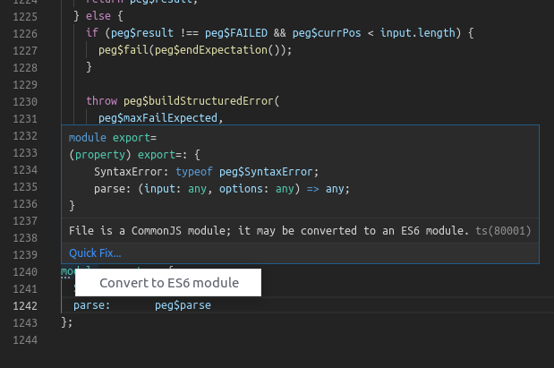

# TinyDude.

TinyDude is a web implementation of the [Little Man Computer](https://en.wikipedia.org/wiki/Little_man_computer) (LMC) instructional model, built with [React](https://reactjs.org/), [MobX](https://mobx.js.org/), and [Material UI](https://material-ui-next.com/).

Check it out [here](https://tinydude.tomwwright.com).

### Running and Building.

TinyDude is built using [CreateReactApp](https://github.com/facebook/create-react-app), so has the standard Yarn scripts available:

```
yarn start      # run local server
yarn build      # create production build
yarn test       # run Jest tests
```

### Building TinyDude+ PEG.js Grammar.

TinyDude+ is a simple, C-like langugage syntax that compiles to TinyDude assembly instructions. The parsing is provided by [PEG.js](https://pegjs.org/) which has a "grammar" that needs to be compiled to a `.js` file (at `src/grammar/tinydudeplus.pegjs`) before building and running. Compiling the grammar has a script:

```
yarn build:grammar
```

**NOTE:** PEG.js outputs an ES5 module that CRA doesn't like. A simple workaround is just to convert the exports to ES6 syntax. Visual Studio Code provides a quick-fix suggestion for this.



## TinyDude Help.

### Code.

Enter your TinyDude program in the provided input box, then click Load to load your program into TinyDude.

### Run.

Click Start and TinyDude will begin executing your program, one instruction each second. You can examine the state on TinyDude via the Program Counter, Accumulator, Memory and Output areas provided. TinyDude will halt execution when it executes a HLT instruction.

### Stop and Reset.

Click Stop while TinyDude is executing to halt the execution early. Once halted, press Start if you wish to resume execution, or edit your program and click Load to reset TinyDude with your new program.

## TinyDude Code Help.

### Wikipedia.

The Wikipedia page for the Little Man Computer (LMC) is really good, you should just check that out.

### INP No-op.

TinyDude does not support the INP (input) instruction, any INP instruction will simply be executed as an OUT (output) instruction.

### Comments.

TinyDude supports Java-style single line comments (i.e. "// this is a comment")

## Example 1: Count down from five.

```

      LDA COUNT

LOOP BRZ QUIT // if the accumulator value is 0, jump to label QUIT
OUT // output our current accumulator
SUB ONE // subtract the value stored at address ONE from the accumulator
BRA LOOP // jump to label LOOP
QUIT HLT // label this memory address as QUIT
COUNT DAT 5 // store 5 here, and label it COUNT
ONE DAT 1 // store 1 here, and label it ONE

```

## Example 2: Square the number three.

```

      LDA NUM   // load the num to square
      STA COUNT // store how many times we need to sum

LOOP BRZ DONE // if accumulator (loop count) is zero, exit our summing loop
LDA SUM // load our total thus far
ADD NUM // add our number to it
STA SUM // store new total
LDA COUNT // load our loop count
SUB ONE // subtract one from loop count
STA COUNT // store our new loop count
BRA LOOP // jump to top of the loop

DONE LDA SUM // load our final total
OUT // output our total
HLT // fin

NUM DAT 3
ONE DAT 1
SUM DAT 0
COUNT DAT 0

```

## TinyDude+

```
// == TinyDude+ ==

// TinyDude+ is a simple, C-like language built by @tomwwright to
// learn about compiling! It is parsed using peg.js then compiled
// to TinyDude assembly code.

// == Features ==

// Comments
// I'm a comment! I extend from // to the end of the line!

// Variables
bool b = false; // boolean type
num n = 3;      // number type

// Assignment
b = true;
n = 4;

// Output
out n;

// Logical operators
bool c = not b;
c = b and c;
c = b or c;
b = (n >= 7) or (n <= 3) or (n == 5);

// WARN: operators < and > not supported!

// Arithmetic operators
n = (n + 3) - 5;

// WARN: operators * / % not supported!

// Conditional
if n == 5 {
  n = n + n;
  out n;
}

// Loop
loop n >= 0 {
  out n;
  n = n - 1;
}
```

```
// Example 1: Count down from 5

num count = 5;

loop count >= 1 {
  out count;
  count = count - 1;
}
```

```
// Example 2: Square the number 4

num n = 4;
num multiplier = n;
num sum = 0;

loop multiplier >= 1 {
  sum = sum + n;
  multiplier = multiplier - 1;
}

out sum;
```
